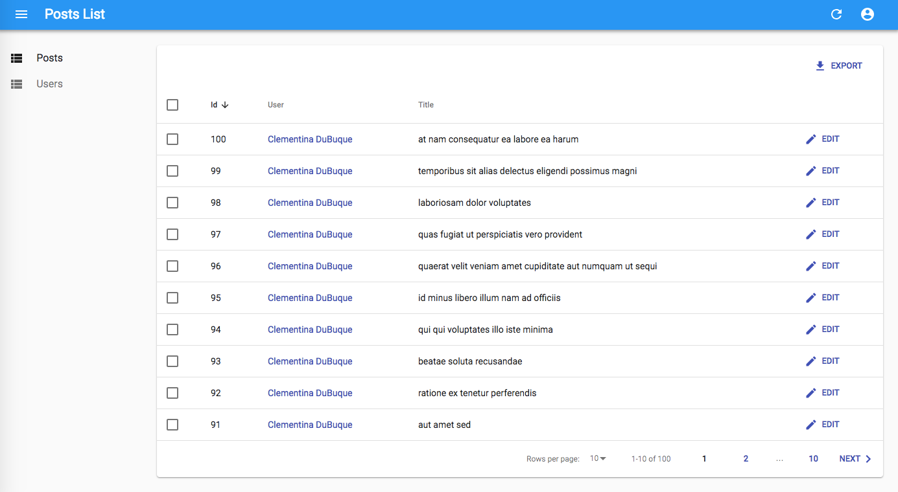
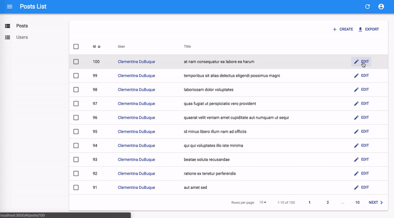
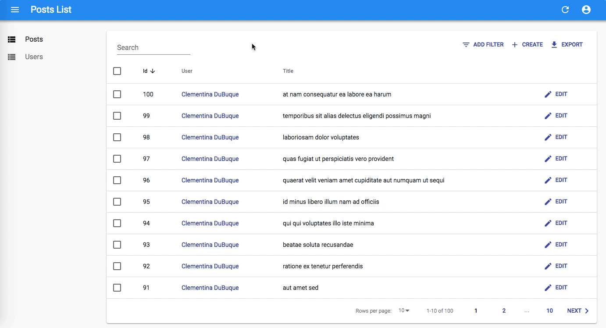
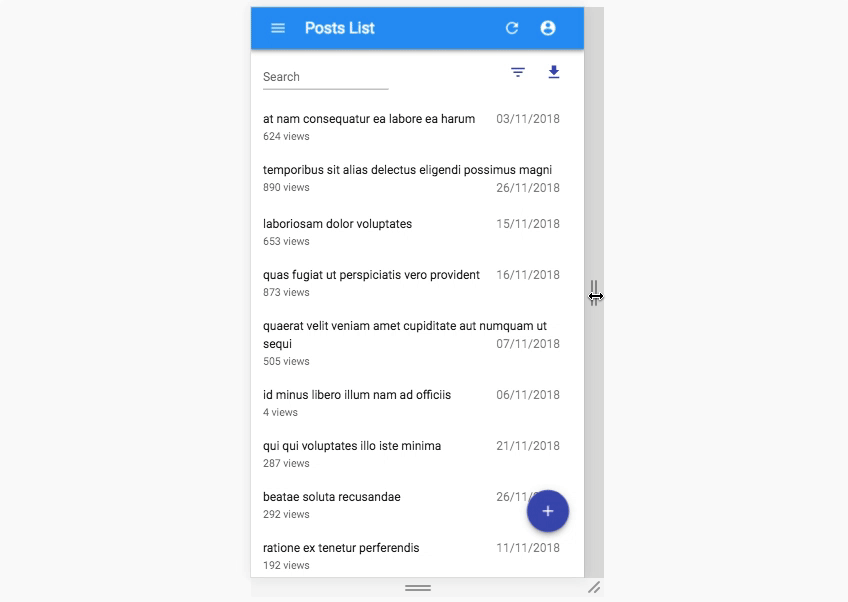

# Tutorial de React-Admin

Este tutorial de 30 minutos expondrá cómo crear una nueva aplicación de administración basada en una API REST existente.

- [Configuracion](#Configuracion)
- [Usar una API como fuente de datos](#Usar-una-API-como-fuente-de-datos)
- [Establecimiento de contacto con la API mediante un proveedor de datos](#Establecimiento-de-contacto-con-la-API-mediante-un-proveedor-de-datos)
- [Asignación de endpoints de API con recursos](#Asignacion-de-endpoints-de-API-con-recursos)
- [Seleccionar columnas](#Seleccionar-columnas)
- [Usar tipos de campo](#)
- [Personalización de estilos](#Personalizacion-de-estilos)
- [Manejo de relaciones](#Manejo-de-relaciones)
- [Adición de capacidades de creación y edición](#Adicion-de-capacidades-de-creacion-y-edicion)
- [Renderizado optimista y deshacer](#Renderizado-optimista-y-deshacer)
- [Agregar búsqueda y filtros a la lista](#Agregar-busqueda-y-filtros-a-la-lista)
- [Personalización de los iconos del menú](#Personalizacion-de-los-iconos-del-menu)
- [Uso de una página de inicio personalizada](#Uso-de-una-pagina-de-inicio-personalizada)
- [Agregar una página de inicio de sesión](#Agregar-una-pagina-de-inicio-de-sesion)
- [Compatibilidad para dispositivos moviles](#Compatibilidad-para-dispositivos-moviles)
- [Conexion a una API real](#Conexion-a-una-API-real)
- [Conclusion](#Conclusion)

## Configuracion

React-admin usa React. Usaremos [create-react-app](https://github.com/facebookincubator/create-react-app) para crear una aplicación React vacía e instalaremos el paquete `react-admin`:

```bash
yarn create react-app test-admin
cd test-admin/
yarn add react-admin ra-data-json-server prop-types
yarn start
```

Debería estar en funcionamiento con una aplicación React vacía en el puerto [3000](http://localhost:3000/).

## Usar una API como fuente de datos

React-admin se ejecuta en el navegador y se basa en los datos que obtiene de las API.

Usaremos [JSONPlaceholder](https://jsonplaceholder.typicode.com/), una API REST falsa diseñada para pruebas y creación de prototipos, como fuente de datos para la aplicación. Así es como se ve:

```bash
curl https://jsonplaceholder.typicode.com/users/2
```

```json
{
  "id": 2,
  "name": "Ervin Howell",
  "username": "Antonette",
  "email": "Shanna@melissa.tv",
  "address": {
    "street": "Victor Plains",
    "suite": "Suite 879",
    "city": "Wisokyburgh",
    "zipcode": "90566-7771",
    "geo": {
      "lat": "-43.9509",
      "lng": "-34.4618"
    }
  },
  "phone": "010-692-6593 x09125",
  "website": "anastasia.net",
  "company": {
    "name": "Deckow-Crist",
    "catchPhrase": "Proactive didactic contingency",
    "bs": "synergize scalable supply-chains"
  }
}
```

JSONPlaceholder proporciona endpoints para usuarios, publicaciones y comentarios. El administrador que crearemos debería permitir Crear, Recuperar, Actualizar y Eliminar (CRUD) estos recursos.

## Establecimiento de contacto con la API mediante un proveedor de datos

Inicie la aplicación de administración reemplazando `src/App.js` por el siguiente código:

```javascript
// en src/App.js
import * as React from "react";
import { Admin } from "react-admin";
import jsonServerProvider from "ra-data-json-server";

const dataProvider = jsonServerProvider("https://jsonplaceholder.typicode.com");
const App = () => <Admin dataProvider={dataProvider} />;

export default App;
```

Eso es suficiente para que react-admin renderice una aplicación vacía y confirme que la configuración está lista:


El componente `App` renderiza un componente `<Admin>`, que es el componente raíz de una aplicación react-admin. Este componente espera un prop `dataProvider`: una función capaz de obtener datos de una API. Dado que no existe un estándar para el intercambio de datos entre computadoras, probablemente tendrá que escribir un provider personalizado para conectar react-admin a sus propias API, pero profundizaremos en los data providers más adelante. Por ahora, aprovechemos el proveedor de datos `ra-data-json-server`, que habla el mismo dialecto REST que JSONPlaceholder.

¡Ahora es el momento de agregar funciones!

## Asignacion de endpoints de API con recursos

Comenzaremos agregando una lista de usuarios.

El componente `<Admin>` espera uno o más componentes `<Resource>` secundarios. Cada recurso asigna un nombre a un endpoint en la API. Edite el archivo `App.js` para agregar un recurso llamado `users`:

```javascript
// en src/App.js
import * as React from "react";
-import { Admin } from 'react-admin';
+import { Admin, Resource, ListGuesser } from 'react-admin';
import jsonServerProvider from 'ra-data-json-server';

const dataProvider = jsonServerProvider('https://jsonplaceholder.typicode.com');
-const App = () => <Admin dataProvider={dataProvider} />;
+const App = () => (
+    <Admin dataProvider={dataProvider}>
+        <Resource name="users" list={ListGuesser} />
+    </Admin>
+);

export default App;
```

La línea `<Resource name="users" />` informa a react-admin que obtenga los registros de "usuarios" de la URL <https://jsonplaceholder.typicode.com/users> . `<Resource>` también define los componentes React para usarse en cada operación CRUD (`list`, `create`, `edit`, y `show`).

El prop `list={ListGuesser}` significa que react-admin debe usar el componente `<ListGuesser>` para mostrar la lista de publicaciones. Este componente _adivina_ el formato que se utilizará para las columnas de la lista en función de los datos obtenidos de la API.

La aplicación ahora puede mostrar una lista de usuarios:


Si observa la pestaña Network en las herramientas de desarrollo del navegador, notará que la aplicación obtuvo la URL <https://jsonplaceholder.typicode.com/users> y luego usó los resultados para construir la cuadrícula de datos. Así es básicamente como funciona react-admin.

La lista ya es funcional: puede reordenarla haciendo clic en los encabezados de las columnas o cambiar de página usando los controles de paginación inferiores. El data provider `ra-data-json-server` traduce estas acciones a una cadena de consulta que JSONPlaceholder comprende.

## Seleccionar columnas

El componente `<ListGuesser>` no está destinado a ser utilizado en producción, es solo una forma de iniciar rápidamente a un administrador. Eso significa que tendrá que reemplazar el componente `ListGuesser` en el recurso users por un componente React personalizado. Afortunadamente, `ListGuesser` descarga el código de la lista que ha adivinado en la consola:


Copiemos este código y creemos un nuevo componente `UserList` en un nuevo archivo llamado `users.js`:

```javascript
// en src/users.js
import * as React from "react";
import { List, Datagrid, TextField, EmailField } from "react-admin";

export const UserList = (props) => (
  <List {...props}>
    <Datagrid rowClick="edit">
      <TextField source="id" />
      <TextField source="name" />
      <TextField source="username" />
      <EmailField source="email" />
      <TextField source="address.street" />
      <TextField source="phone" />
      <TextField source="website" />
      <TextField source="company.name" />
    </Datagrid>
  </List>
);
```

Luego, edite el archivo `App.js` para usar este nuevo componente en lugar de `ListGuesser`:

```javascript
// en src/App.js
-import { Admin, Resource, ListGuesser } from 'react-admin';
+import { Admin, Resource } from 'react-admin';
+import { UserList } from './users';

const App = () => (
    <Admin dataProvider={dataProvider}>
-       <Resource name="users" list={ListGuesser} />
+       <Resource name="users" list={UserList} />
    </Admin>
);
```


No hay ningún cambio visible en el navegador, excepto que ahora, la aplicación utiliza un componente que puede personalizar.

El componente principal de la lista de usuarios es un componente `<List>`, responsable de obtener la información de la API, mostrar el título de la página y manejar la paginación. Este componente luego delega la visualización de la lista real de usuarios a su hijo. En este caso, es un componente `<Datagrid>`, que genera una tabla con una fila para cada registro. El Datagrid usa sus componentes secundarios (aquí, una lista de `<TextField>` y `<EmailField>`) para determinar las columnas a representar. Cada componente de campo asigna un campo diferente en la respuesta de la API, especificado por el prop `source`.

El `ListGuesser` creó una columna para cada campo en la respuesta. Eso es demasiado para una cuadrícula utilizable, así que eliminemos un par de `<TextField>` de la cuadrícula de datos y veamos el efecto:

```javascript
// en src/users.js
import * as React from "react";
import { List, Datagrid, TextField, EmailField } from "react-admin";

export const UserList = (props) => (
  <List {...props}>
    <Datagrid rowClick="edit">
      <TextField source="id" />
      <TextField source="name" />
      - <TextField source="username" />
      <EmailField source="email" />
      - <TextField source="address.street" />
      <TextField source="phone" />
      <TextField source="website" />
      <TextField source="company.name" />
    </Datagrid>
  </List>
);
```


Lo que acaba de hacer refleja las primeras etapas de desarrollo con react-admin: deje que el _guesser_ haga el trabajo, seleccione solo los campos que desee y comience a personalizar los tipos.

## Usar tipos de campo

Acaba de conocer los componentes `<TextField>` y `<EmailField>`. React-admin proporciona muchos más [componentes de campo](), mapeando varios tipos de datos: número, fecha, imagen, HTML, matriz, referencia, etc.

Por ejemplo, el campo `website` parece una URL. En lugar de mostrarlo como texto, ¿por qué no mostrarlo mediante un enlace en el que se puede hacer clic? Eso es exactamente lo que hace `<UrlField>`:

```javascript
// en src/users.js
import * as React from "react";
-import { List, Datagrid, TextField, EmailField } from 'react-admin';
+import { List, Datagrid, TextField, EmailField, UrlField } from 'react-admin';

export const UserList = props => (
    <List {...props}>
        <Datagrid rowClick="edit">
            <TextField source="id" />
            <TextField source="name" />
            <EmailField source="email" />
            <TextField source="phone" />
-           <TextField source="website" />
+           <UrlField source="website" />
            <TextField source="company.name" />
        </Datagrid>
    </List>
);
```


En react-admin, los campos son componentes simples de React. En tiempo de ejecución, reciben el `record` btenido de la API (p.Ej. `{ "id": 2, "name": "Ervin Howell", "website": "anastasia.net", ... }`) Y el campo source que deben mostrar (p.Ej. `website`).

Eso significa que escribir un componente de campo personalizado es realmente sencillo. Por ejemplo, aquí hay una versión simplificada de `UrlField`:

```javascript
// en src/MyUrlField.js
import * as React from "react";

const MyUrlField = ({ record = {}, source }) => (
  <a href={record[source]}>{record[source]}</a>
);

export default MyUrlField;
```

Puede usar este componente en `<UserList>`, en lugar del componente de react-admin `<UrlField>`, y funcionará de la misma manera.

```javascript
// in src/users.js
import * as React from "react";
-import { List, Datagrid, TextField, EmailField, UrlField } from 'react-admin';
+import { List, Datagrid, TextField, EmailField } from 'react-admin';
+import MyUrlField from './MyUrlField';

export const UserList = props => (
    <List {...props}>
        <Datagrid rowClick="edit">
            <TextField source="id" />
            <TextField source="name" />
            <EmailField source="email" />
            <TextField source="phone" />
-           <UrlField source="website" />
+           <MyUrlField source="website" />
            <TextField source="company.name" />
        </Datagrid>
    </List>
);
```

Sí, puede reemplazar cualquiera de los componentes de react-admin por el suyo. Eso significa que react-admin nunca te bloquea: si un componente react-admin no se adapta perfectamente a tus necesidades, puedes intercambiarlo fácilmente con tu propia versión.

## Personalizacion de estilos

El componente `MyUrlField` es una oportunidad perfecta para ilustrar cómo personalizar estilos. React-admin se basa en [material-ui](https://material-ui.com/), un conjunto de componentes de React modelados según las [Pautas de la Interfaz de Usuario de Material Design](https://material.io/) de Google . Material-ui usa [JSS](https://github.com/cssinjs/jss), una solución CSS-in-JS, para diseñar componentes. Aprovechemos las capacidades de JSS para eliminar el subrayado del enlace y agregar un icono:

```javascript
// in src/MyUrlField.js
import * as React from "react";
import { makeStyles } from "@material-ui/core/styles";
import LaunchIcon from "@material-ui/icons/Launch";

const useStyles = makeStyles({
  link: {
    textDecoration: "none",
  },
  icon: {
    width: "0.5em",
    paddingLeft: 2,
  },
});

const MyUrlField = ({ record = {}, source }) => {
  const classes = useStyles();
  return (
    <a href={record[source]} className={classes.link}>
      {record[source]}
      <LaunchIcon className={classes.icon} />
    </a>
  );
};

export default MyUrlField;
```


En JSS, define estilos como un objeto JavaScript, utilizando las variantes JS de los nombres de propiedad CSS (por ejemplo, `textDecoration` en lugar de `text-decoration`). Para pasar estos estilos al componente, use `makeStyles` para construir un hook de React. El hook creará nuevos nombres de clase para estos estilos y devolverá los nuevos nombres de clase en el objeto `classes`. Luego, use estos nombres en un prop `className`, como lo haría con una clase CSS normal.

**Tip**: JSS es mucho más de lo que cubre este tutorial. Lea la [documentación de material-ui](https://material-ui.com/styles/basics) para obtener más información sobre temas, prefijos de proveedores, utilidades receptivas, etc.

**Tip**: Material-ui admite otras soluciones CSS-in-JS, incluido [Styled components](https://material-ui.com/styles/basics/#styled-components-api).

## Manejo de relaciones

En JSONPlaceholder, cada registro `post` incluye un campo `userId`, que apunta a `user`:

```json
{
  "id": 1,
  "title": "sunt aut facere repellat provident occaecati excepturi optio reprehenderit",
  "body": "quia et suscipit\nsuscipit recusandae consequuntur expedita et cum\nreprehenderit molestiae ut ut quas totam\nnostrum rerum est autem sunt rem eveniet architecto",
  "userId": 1
}
```

React-admin sabe cómo aprovechar estas claves externas para buscar referencias. Veamos cómo los gestiona `ListGuesser` creando un nuevo `<Resource>` para el endopoint `/posts` de la API:

```javascript
// en src/App.js
import * as React from "react";
-import { Admin, Resource } from 'react-admin';
+import { Admin, Resource, ListGuesser } from 'react-admin';
import jsonServerProvider from 'ra-data-json-server';
import { UserList } from './users';

const App = () => (
    <Admin dataProvider={dataProvider}>
+       <Resource name="posts" list={ListGuesser} />
        <Resource name="users" list={UserList} />
    </Admin>
);

export default App;
```


El `ListGuesser` sugiere usar una `<ReferenceField>` para el campo `userId`. Juguemos con este nuevo campo creando el componente `PostList` basado en el código descargado por el guesser:

```javascript
// en src/posts.js
import * as React from "react";
import { List, Datagrid, TextField, ReferenceField } from "react-admin";

export const PostList = (props) => (
  <List {...props}>
    <Datagrid rowClick="edit">
      <ReferenceField source="userId" reference="users">
        <TextField source="id" />
      </ReferenceField>
      <TextField source="id" />
      <TextField source="title" />
      <TextField source="body" />
    </Datagrid>
  </List>
);
```

```javascript
// en src/App.js
-import { Admin, Resource, ListGuesser } from 'react-admin';
+import { Admin, Resource } from 'react-admin';
+import { PostList } from './posts';
import { UserList } from './users';

const App = () => (
    <Admin dataProvider={dataProvider}>
-       <Resource name="posts" list={ListGuesser} />
+       <Resource name="posts" list={PostList} />
        <Resource name="users" list={UserList} />
    </Admin>
);
```

Al mostrar la lista de publicaciones, la aplicación muestra el `id` del nombre del autor de la publicación como `<TextField>`. Este campo `id` no significa mucho, usemos en su lugar el `name` del usuario:

```javascript
// in src/posts.js
export const PostList = (props) => (
  <List {...props}>
    <Datagrid rowClick="edit">
      <ReferenceField source="userId" reference="users">
        - <TextField source="id" />
        + <TextField source="name" />
      </ReferenceField>
      <TextField source="id" />
      <TextField source="title" />
      <TextField source="body" />
    </Datagrid>
  </List>
);
```

La lista de publicaciones ahora muestra los nombres de usuario en cada línea.


**Tip**: el componente `<ReferenceField>` por sí solo no muestra nada. Simplemente obtiene los datos de referencia y los pasa como `record` a su componente hijo (a `<TextField>` en nuestro caso). Al igual que el componente `<List>`, todos los componentes `<Reference>` solo son responsables de obtener y preparar datos, y delegar la representación a sus hijos.

**Tip**: Mire la pestaña Network de su navegador nuevamente: react-admin deduplica las solicitudes de los usuarios y las agrega para realizar solo _una_ solicitud HTTP al endpoint `/users` para todo el Datagrid. Esa es una de las muchas optimizaciones que mantienen la interfaz de usuario rápida y receptiva.

Para finalizar la lista de publicaciones, coloque el campo `id` de publicación como primera columna y elimine el campo `body`. Desde el punto de vista de UX, los campos que contienen grandes fragmentos de texto no deben aparecer en una cuadrícula de datos, solo en vistas detalladas. Además, para que la acción Editar se destaque, reemplacemos la acción `rowClick` por un botón de acción explícito:

```javascript
// en src/posts.js
import * as React from "react";
-import { List, Datagrid, TextField, ReferenceField } from 'react-admin';
+import { List, Datagrid, TextField, ReferenceField, EditButton } from 'react-admin';

export const PostList = props => (
    <List {...props}>
-       <Datagrid rowClick="edit">
+       <Datagrid>
+           <TextField source="id" />
            <ReferenceField source="userId" reference="users">
                <TextField source="name" />
            </ReferenceField>
-           <TextField source="id" />
            <TextField source="title" />
-           <TextField source="body" />
+           <EditButton />
        </Datagrid>
    </List>
);
```



## Adición de capacidades de creación y edición

Una interfaz de administración no se trata solo de mostrar datos remotos, también debe permitir la edición de registros. React-admin proporciona componentes `<Edit>` para ese propósito; usemos el `<EditGuesser>` para ayudar a arrancarlo.

```javascript
// en src/App.js
-import { Admin, Resource } from 'react-admin';
+import { Admin, Resource, EditGuesser } from 'react-admin';
import { PostList } from './posts';
import { UserList } from './users';

const App = () => (
    <Admin dataProvider={dataProvider}>
-       <Resource name="posts" list={PostList} />
+       <Resource name="posts" list={PostList} edit={EditGuesser} />
        <Resource name="users" list={UserList} />
    </Admin>
);
```


Los usuarios pueden mostrar la página de edición simplemente haciendo clic en el botón Edit. El formulario renderizado ya es funcional; emite solicitudes `PUT` a la API REST al enviarlas.

Copie el código descargado `PostEdit` por el guesser en la consola en el archivo `posts.js` para que pueda personalizar la vista. No olvide hacer `import` de los nuevos componentes de react-admin:

```javascript
// en src/posts.js
import * as React from "react";
import {
  List,
  Datagrid,
  TextField,
  ReferenceField,
  EditButton,
  Edit,
  SimpleForm,
  ReferenceInput,
  SelectInput,
  TextInput,
} from "react-admin";

export const PostList = (props) => ({
  /* ... */
});

export const PostEdit = (props) => (
  <Edit {...props}>
    <SimpleForm>
      <ReferenceInput source="userId" reference="users">
        <SelectInput optionText="id" />
      </ReferenceInput>
      <TextInput source="id" />
      <TextInput source="title" />
      <TextInput source="body" />
    </SimpleForm>
  </Edit>
);
```

Ahora puede ajustar el componente `PostEdit` para deshabilitar la edición de la clave principal (`id`), colocarlo primero, usar el `name` de usuario en lugar del `id` de usuario en la referencia y usar una entrada de texto más larga para el campo `body`, de la siguiente manera:

```javascript
// en src/posts.js
export const PostEdit = (props) => (
  <Edit {...props}>
    <SimpleForm>
      + <TextInput disabled source="id" />
      <ReferenceInput source="userId" reference="users">
        - <SelectInput optionText="id" />
        + <SelectInput optionText="name" />
      </ReferenceInput>
      - <TextInput source="id" />
      <TextInput source="title" />
      - <TextInput source="body" />
      + <TextInput multiline source="body" />
    </SimpleForm>
  </Edit>
);
```

Si ha entendido el componente `<List>`, el componente `<Edit>` no le sorprenderá. Es responsable de buscar el registro y mostrar el título de la página. Pasa el registro al componente `<SimpleForm>`, que es responsable del diseño del formulario, los valores predeterminados y la validación. Al igual que `<Datagrid>`, `<SimpleForm>` utiliza sus elementos secundarios para determinar las entradas de formulario que se mostrarán. Espera componentes de entrada como hijos. `<TextInput>`, `<ReferenceInput>` y `<SelectInput>` son tales entradas.

El `<ReferenceInput>` toma los mismos props que el `<ReferenceField>`(utilizado anteriormente en la página `PostList`). `<ReferenceInput>` utiliza estos accesorios para buscar la API para posibles referencias relacionadas con el registro actual (en este caso, posibles `users` para el actual post). Luego pasa estas posibles referencias al componente hijo (`<SelectInput>`), que es responsable de mostrarlas (a través de su `name` en ese caso) y dejar que el usuario seleccione una. `<SelectInput>` se representa como una etiqueta `<select>` en HTML.

Antes de poder usar ese componente personalizado en `App.js`, copie el componente `PostEdit` en un `PostCreate` y reemplace `Edit` por `Create`:

```javascript
// en src/posts.js
import * as React from "react";
import {
    List,
    Datagrid,
    TextField,
    ReferenceField,
    EditButton,
    Edit,
+   Create,
    SimpleForm,
    ReferenceInput,
    SelectInput,
    TextInput,
} from 'react-admin';

export const PostList = props => (
    // ...
);

export const PostEdit = props => (
    // ...
);

+export const PostCreate = props => (
+    <Create {...props}>
+        <SimpleForm>
+            <ReferenceInput source="userId" reference="users">
+                <SelectInput optionText="name" />
+            </ReferenceInput>
+            <TextInput source="title" />
+            <TextInput multiline source="body" />
+        </SimpleForm>
+    </Create>
+);
```

**Tip**: Los componentes `<PostEdit>` y `<PostCreate>` utilizan casi el mismo formulario secundario, excepto por el adicional entrada `id` en `<PostEdit>`. En la mayoría de los casos, los formularios para crear y editar un registro son un poco diferentes, porque la mayoría de las API crean claves primarias en el lado del servidor. Pero si los formularios son los mismos, puede compartir un componente de formulario común en `<PostEdit>` y `<PostCreate>`.

Para usar los componentes nuevos `<PostEdit>` y `<PostCreate>` en el recurso de publicaciones, simplemente agréguelos como atributos `edit` y `create` en el componente `<Resource name="posts">`:

```javascript
// en src/App.js
-import { Admin, Resource, EditGuesser } from 'react-admin';
+import { Admin, Resource } from 'react-admin';
-import { PostList } from './posts';
+import { PostList, PostEdit, PostCreate } from './posts';
import { UserList } from './users';

const App = () => (
    <Admin dataProvider={dataProvider}>
-       <Resource name="posts" list={PostList} edit={EditGuesser} />
+       <Resource name="posts" list={PostList} edit={PostEdit} create={PostCreate} />
        <Resource name="users" list={UserList} />
    </Admin>
);
```


React-admin agrega automáticamente un botón "crear" en la parte superior de la lista de publicaciones para dar acceso al componente <PostCreate>. Y la forma de creación funciona; emite una solicitud `POST` a la API REST al enviarla.

## Renderizado optimista y deshacer

Desafortunadamente, JSONPlaceholder es una API de solo lectura; aunque parece aceptar solicitudes `POST` y `PUT`, no tiene en cuenta las creaciones y ediciones; por eso, en este caso particular, verá errores después de la creación y no verá sus ediciones después de guardarlas. Es solo un artefacto de JSONPlaceholder.

Pero entonces, ¿cómo es que la publicación recién creada aparece en la lista justo después de la creación en el screencast de arriba?

Eso es porque react-admin usa una _representación optimista_. Cuando un usuario edita un registro y presiona el botón "Guardar", la interfaz de usuario muestra una confirmación y muestra los datos actualizados _antes de enviar la consulta de actualización al servidor_. El principal beneficio es que los cambios en la interfaz de usuario son inmediatos, no es necesario esperar la respuesta del servidor. Es una gran comodidad para los usuarios.

Pero hay un beneficio adicional: también permite la función "Deshacer". Deshacer ya es funcional en el administrador en ese momento. Intente editar un registro, luego presione el enlace "Deshacer" en el cuadro de confirmación negro antes de que se deslice. Verá que la aplicación no envía la consulta `UPDATE` a la API y muestra los datos no modificados.



Aunque las actualizaciones aparecen inmediatamente debido a Optimistic Rendering, React-admin solo las envía al servidor después de un breve retraso (aproximadamente 5 segundos). Durante este retraso, el usuario puede deshacer la acción y react-admin nunca enviará la actualización.

Optimistic Rendering y Undo no requieren un código específico en el lado de la API; react-admin los maneja únicamente en el lado del cliente. ¡Eso significa que los obtendrá gratis con su propia API!

**Nota**: cuando agrega la capacidad de editar un elemento, también agrega la capacidad de eliminarlo. El botón "Eliminar" en la vista de edición funciona completamente desde el primer momento, y también se puede "Deshacer".

La página de edición de publicaciones tiene un pequeño problema: utiliza la identificación de la publicación como título principal (el texto que se muestra en la barra superior). Personalicemos el título de la vista con un componente de título:

```javascript
// en src/posts.js
+const PostTitle = ({ record }) => {
+    return <span>Post {record ? `"${record.title}"` : ''}</span>;
+};

export const PostEdit = props => (
-   <Edit {...props}>
+   <Edit title={<PostTitle />} {...props}>
        // ...
    </Edit>
);
```


## Agregar busqueda y filtros a la lista

Volvamos a la lista de publicaciones por un minuto. Ofrece clasificación y paginación, pero falta una característica: la capacidad de buscar contenido.

React-admin puede usar componentes de entrada para crear un motor de búsqueda de varios criterios en la vista de lista. Primero, cree un componente `<Filter>` como escribiría un componente `<SimpleForm>`, utilizando componentes de entrada como hijos. Luego, agréguelo a la lista usando el prop `filters`:

```javascript
// en src/posts.js
import {
  Filter,
  ReferenceInput,
  SelectInput,
  TextInput,
  List,
} from "react-admin";

const PostFilter = (props) => (
  <Filter {...props}>
    <TextInput label="Search" source="q" alwaysOn />
    <ReferenceInput label="User" source="userId" reference="users" allowEmpty>
      <SelectInput optionText="name" />
    </ReferenceInput>
  </Filter>
);

export const PostList = (props) => (
  <List filters={<PostFilter />} {...props}>
    // ...
  </List>
);
```

El primer filtro, 'q', aprovecha una funcionalidad de texto completo que ofrece JSONPlaceholder. Este es `alwaysOn`, por lo que siempre aparece en la pantalla. Los usuarios pueden agregar el segundo filtro, `userId` gracias al botón "add filter", ubicado en la parte superior de la lista. Como `<ReferenceInput>`, ya está repleto de posibles usuarios.



Los filtros son de "búsqueda a medida que escribe", lo que significa que cuando el usuario ingresa nuevos valores en el formulario de filtro, la lista se actualiza (a través de una solicitud de API) inmediatamente.

**Tip**: tenga en cuenta que la propiedad `label` se puede utilizar en cualquier campo para personalizar la etiqueta del campo.

## Personalizacion de los iconos del menu

El menú de la barra lateral muestra el mismo icono tanto para publicaciones como para usuarios. Personalizar el icono del menú es solo cuestión de pasar un atributo `icon` a cada `<Resource>`:

```javascript
// en src/App.js
import PostIcon from "@material-ui/icons/Book";
import UserIcon from "@material-ui/icons/Group";

const App = () => (
  <Admin dataProvider={dataProvider}>
    <Resource
      name="posts"
      list={PostList}
      edit={PostEdit}
      create={PostCreate}
      icon={PostIcon}
    />
    <Resource name="users" list={UserList} icon={UserIcon} />
  </Admin>
);
```


## Uso de una pagina de inicio personalizada

De forma predeterminada, react-admin muestra la página de lista del primer elemento `Resource` como página de inicio. Si desea mostrar un componente personalizado en su lugar, páselo en el prop `dashboard` del componente `<Admin>`.

```javascript
// en src/Dashboard.js
import * as React from "react";
import { Card, CardContent, CardHeader } from "@material-ui/core";

export default () => (
  <Card>
    <CardHeader title="Welcome to the administration" />
    <CardContent>Lorem ipsum sic dolor amet...</CardContent>
  </Card>
);
```

```javascript
// in src/App.js
import Dashboard from "./Dashboard";

const App = () => (
  <Admin dashboard={Dashboard} dataProvider={dataProvider}>
    // ...
  </Admin>
);
```


## Agregar una pagina de inicio de sesion

La mayoría de las aplicaciones de administración requieren autenticación. React-admin puede verificar las credenciales del usuario antes de mostrar una página y redirigir a un formulario de inicio de sesión cuando la API REST devuelve un código de error 403.

_Cuáles_ son esas credenciales y _cómo_ obtenerlas son preguntas que usted, como desarrollador, debe responder. React-admin no hace ninguna suposición sobre su estrategia de autenticación (autenticación básica, OAuth, ruta personalizada, etc.), pero le brinda la capacidad de conectar su lógica en el lugar correcto, usando el objeto `authProvider`.

Para este tutorial, dado que no hay una API de autenticación pública, podemos usar un proveedor de autenticación falso que acepta todas las solicitudes de inicio de sesión y almacena el archivo `username` en `localStorage`. Cada cambio de página requerirá que `localStorage` contenga un elemento `username`.

El `authProvider` debe exponer a 5 métodos, volviendo cada una `Promise`:

```javascript
// en src/authProvider.js
export default {
  // called when the user attempts to log in
  login: ({ username }) => {
    localStorage.setItem("username", username);
    // accept all username/password combinations
    return Promise.resolve();
  },
  // called when the user clicks on the logout button
  logout: () => {
    localStorage.removeItem("username");
    return Promise.resolve();
  },
  // called when the API returns an error
  checkError: ({ status }) => {
    if (status === 401 || status === 403) {
      localStorage.removeItem("username");
      return Promise.reject();
    }
    return Promise.resolve();
  },
  // called when the user navigates to a new location, to check for authentication
  checkAuth: () => {
    return localStorage.getItem("username")
      ? Promise.resolve()
      : Promise.reject();
  },
  // called when the user navigates to a new location, to check for permissions / roles
  getPermissions: () => Promise.resolve(),
};
```

**Tip**: como las llamadas `authProvider` son asincrónicas, puede buscar fácilmente un servidor de autenticación allí.

Para habilitar esta estrategia de autenticación, pase el cliente como prop `authProvider` en el componente `<Admin>`:

```javascript
// en src/App.js
import Dashboard from "./Dashboard";
import authProvider from "./authProvider";

const App = () => (
  <Admin
    dashboard={Dashboard}
    authProvider={authProvider}
    dataProvider={dataProvider}
  >
    // ...
  </Admin>
);
```

Una vez que la aplicación se vuelve a cargar, ahora está detrás de un formulario de inicio de sesión que acepta a todos:


## Compatibilidad para dispositivos moviles

El diseño de react-admin ya es responsivo. Intente cambiar el tamaño de su navegador para ver cómo la barra lateral cambia a un cajón en pantallas más pequeñas.

Pero un diseño responsivo no es suficiente para hacer una aplicación responsiva. Los componentes de Datagrid funcionan bien en el escritorio, pero no se adaptan en absoluto a los dispositivos móviles. Si su administrador debe utilizarse en dispositivos móviles, deberá proporcionar un componente alternativo para pantallas pequeñas.

Primero, debe saber que no tiene que usar el componente `<Datagrid>` como hijo de `<List>`. Puede utilizar cualquier otro componente que desee. Por ejemplo, el componente `<SimpleList>`:

```javascript
// in src/posts.js
import * as React from "react";
import { List, SimpleList } from "react-admin";

export const PostList = (props) => (
  <List {...props}>
    <SimpleList
      primaryText={(record) => record.title}
      secondaryText={(record) => `${record.views} views`}
      tertiaryText={(record) =>
        new Date(record.published_at).toLocaleDateString()
      }
    />
  </List>
);
```


El componente `<SimpleList>` usa [componentes `<List>` y `<ListItem>` de material-ui](https://material-ui.com/components/lists), y espera funciones como `primaryText`, `secondaryText` y props `tertiaryText`.

**Nota**: Desde JSONRestServer no proporcionavalores de `views` o `published_at` para los mensajes, y cambiamos a una API personalizada para aquellas capturas de pantalla con el fin de demostrar cómo utilizar algunos de los props de componentes `SimpleList`.

Eso funciona bien en dispositivos móviles, pero ahora la experiencia del usuario de escritorio es peor. El mejor compromiso sería usar `<SimpleList>` en pantallas pequeñas y `<Datagrid>` en otras pantallas. Ahí es donde el hook `useMediaQuery` entra:

```javascript
// en src/posts.js
import * as React from "react";
import { useMediaQuery } from "@material-ui/core";
import {
  List,
  SimpleList,
  Datagrid,
  TextField,
  ReferenceField,
  EditButton,
} from "react-admin";

export const PostList = (props) => {
  const isSmall = useMediaQuery((theme) => theme.breakpoints.down("sm"));
  return (
    <List {...props}>
      {isSmall ? (
        <SimpleList
          primaryText={(record) => record.title}
          secondaryText={(record) => `${record.views} views`}
          tertiaryText={(record) =>
            new Date(record.published_at).toLocaleDateString()
          }
        />
      ) : (
        <Datagrid>
          <TextField source="id" />
          <ReferenceField label="User" source="userId" reference="users">
            <TextField source="name" />
          </ReferenceField>
          <TextField source="title" />
          <TextField source="body" />
          <EditButton />
        </Datagrid>
      )}
    </List>
  );
};
```

Esto funciona exactamente como esperas. La lección aquí es que react-admin se encarga del diseño web receptivo para el diseño, pero es su trabajo usar `useMediaQuery()` en las páginas.



## Conexion a una API real

Aquí está el elefante en la habitación de este tutorial. En proyectos del mundo real, el dialecto de su API (REST? GraphQL? ¿Algo más?) No coincidirá con el dialecto JSONPlaceholder. Escribir un Data Provider es probablemente lo primero que tendrá que hacer para que funcione react-admin. Dependiendo de su API, esto puede requerir algunas horas de trabajo adicional.

React-admin delega cada consulta de datos a un objeto Data Provider, que actúa como un adaptador para su API. Esto hace que react-admin sea capaz de mapear cualquier dialecto de API, utilizando endpoints de varios dominios, etc.

Por ejemplo, imaginemos que tiene que usar la API REST `my.api.url`, que espera los siguientes parámetros:

| Acción                         | Solicitud de API esperada                                                             |
| ------------------------------ | ------------------------------------------------------------------------------------- |
| Obtener lista                  | GET http://my.api.url/posts?sort=["title","ASC"]&range=[0, 24]&filter={"title":"bar"} |
| Obtener un registro            | GET http://my.api.url/posts/123                                                       |
| Obtenga varios registros       | GET http://my.api.url/posts?filter={"id":[123,456,789]}                               |
| Obtener registros relacionados | GET http://my.api.url/posts?filter={"author_id":345}                                  |
| Crea un registro               | POST http://my.api.url/posts                                                          |
| Actualizar un registro         | PUT http://my.api.url/posts/123                                                       |
| Actualizar registros           | PUT http://my.api.url/posts?filter={"id":[123,124,125]}                               |
| Eliminar un registro           | DELETE http://my.api.url/posts/123                                                    |
| Eliminar registros             | DELETE http://my.api.url/posts?filter={"id":[123,124,125]}                            |

React-admin llama al Data Provider con un método para cada una de las acciones de esta lista y espera una promesa a cambio. Estos métodos se llaman `getList`, `getOne`, `getMany`, `getManyReference`, `create`, `update`, `updateMany`, `delete`, y `deleteMany`. El trabajo del Data Provider es emitir solicitudes HTTP y transformar la respuesta al formato esperado por react-admin.

El código de un Data Provider para la API `my.api.url` es el siguiente:

```javascript
import { fetchUtils } from "react-admin";
import { stringify } from "query-string";

const apiUrl = "https://my.api.com/";
const httpClient = fetchUtils.fetchJson;

export default {
  getList: (resource, params) => {
    const { page, perPage } = params.pagination;
    const { field, order } = params.sort;
    const query = {
      sort: JSON.stringify([field, order]),
      range: JSON.stringify([(page - 1) * perPage, page * perPage - 1]),
      filter: JSON.stringify(params.filter),
    };
    const url = `${apiUrl}/${resource}?${stringify(query)}`;

    return httpClient(url).then(({ headers, json }) => ({
      data: json,
      total: parseInt(headers.get("content-range").split("/").pop(), 10),
    }));
  },

  getOne: (resource, params) =>
    httpClient(`${apiUrl}/${resource}/${params.id}`).then(({ json }) => ({
      data: json,
    })),

  getMany: (resource, params) => {
    const query = {
      filter: JSON.stringify({ id: params.ids }),
    };
    const url = `${apiUrl}/${resource}?${stringify(query)}`;
    return httpClient(url).then(({ json }) => ({ data: json }));
  },

  getManyReference: (resource, params) => {
    const { page, perPage } = params.pagination;
    const { field, order } = params.sort;
    const query = {
      sort: JSON.stringify([field, order]),
      range: JSON.stringify([(page - 1) * perPage, page * perPage - 1]),
      filter: JSON.stringify({
        ...params.filter,
        [params.target]: params.id,
      }),
    };
    const url = `${apiUrl}/${resource}?${stringify(query)}`;

    return httpClient(url).then(({ headers, json }) => ({
      data: json,
      total: parseInt(headers.get("content-range").split("/").pop(), 10),
    }));
  },

  update: (resource, params) =>
    httpClient(`${apiUrl}/${resource}/${params.id}`, {
      method: "PUT",
      body: JSON.stringify(params.data),
    }).then(({ json }) => ({ data: json })),

  updateMany: (resource, params) => {
    const query = {
      filter: JSON.stringify({ id: params.ids }),
    };
    return httpClient(`${apiUrl}/${resource}?${stringify(query)}`, {
      method: "PUT",
      body: JSON.stringify(params.data),
    }).then(({ json }) => ({ data: json }));
  },

  create: (resource, params) =>
    httpClient(`${apiUrl}/${resource}`, {
      method: "POST",
      body: JSON.stringify(params.data),
    }).then(({ json }) => ({
      data: { ...params.data, id: json.id },
    })),

  delete: (resource, params) =>
    httpClient(`${apiUrl}/${resource}/${params.id}`, {
      method: "DELETE",
    }).then(({ json }) => ({ data: json })),

  deleteMany: (resource, params) => {
    const query = {
      filter: JSON.stringify({ id: params.ids }),
    };
    return httpClient(`${apiUrl}/${resource}?${stringify(query)}`, {
      method: "DELETE",
    }).then(({ json }) => ({ data: json }));
  },
};
```

**Tip**: `fetchUtils.fetchJson()` es solo un atajo para `fetch().then(r => r.json())`, más un control del código de respuesta HTTP para lanzar una respuesta `HTTPError` en caso de 4xx o 5xx. Siéntase libre de usar `fetch()` directamente si no se adapta a sus necesidades.

Usar este Provider en lugar del anterior `jsonServerProvider` es solo una cuestión de cambiar una función:

```javascript
// en src/app.js
import dataProvider from "./dataProvider";

const App = () => <Admin dataProvider={dataProvider}>// ...</Admin>;
```

## Conclusion

React-admin se creó pensando en la personalización. Puede reemplazar cualquier componente react-admin con un componente propio, por ejemplo, para mostrar un diseño de lista personalizado o un formulario de edición diferente para un recurso determinado.

Ahora que ha completado el tutorial, continúe leyendo la [documentación de react-admin](/README.md) y lea la [documentación de los componentes de Material UI](https://material-ui.com/).
